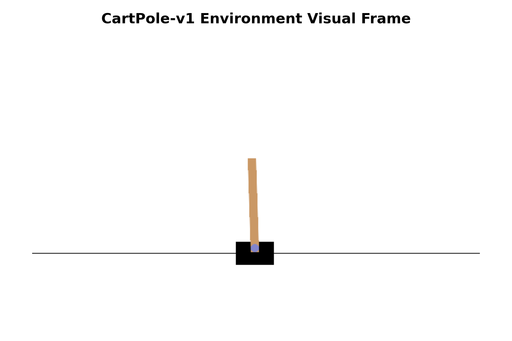
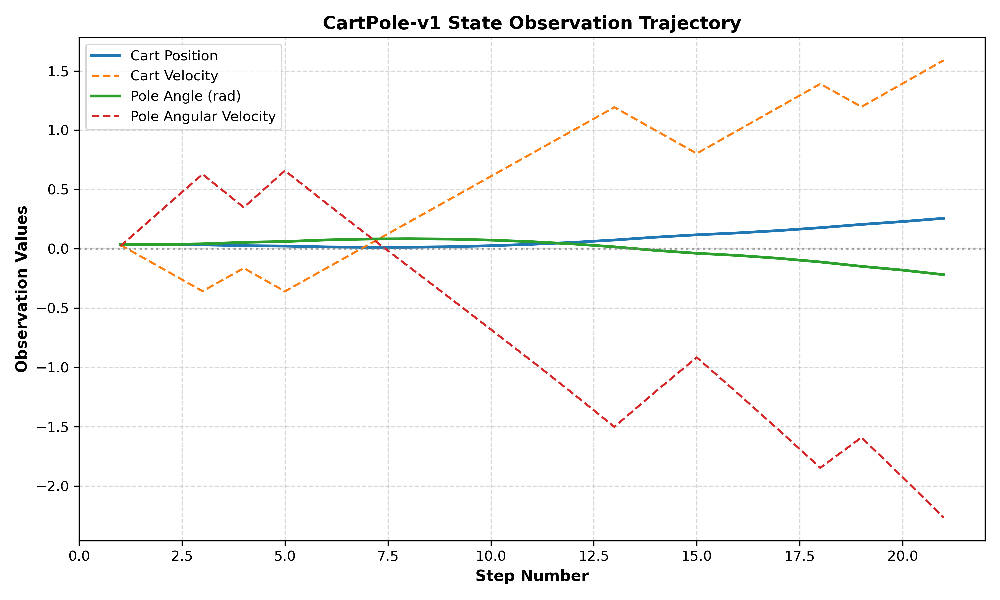

# Reinforcement Learning Laboratory Experiment 1

## Objective
The goal of this laboratory experiment is to explore Reinforcement Learning (RL) environments using Farama Foundation's **Gymnasium** library. This project demonstrates how to initialize an RL environment (`CartPole-v1`), inspect its observation and action spaces, execute a random control agent, and handle step transitions and termination conditions cleanly.

---

## Project Structure

```
RL_Lab_01/
│
├── main.py            # Main Python implementation script
├── requirements.txt   # Project dependencies
├── README.md          # Complete experiment documentation
├── .gitignore         # Version control ignore rules
└── screenshots/       # Visual outputs and execution screenshots
    ├── cartpole_render.png
    └── episode_trajectory.png
```

---

## Installation

Ensure you have Python 3.10+ installed. Install project dependencies using `pip`:

```bash
pip install -r requirements.txt
```

If Gymnasium is not installed or encounters rendering missing modules, install Pygame and Gymnasium explicitly:

```bash
pip install gymnasium numpy matplotlib pygame
```

---

## Running

Execute the main experiment script from the project root:

```bash
python main.py
```

Running `main.py` automatically generates visual screenshots of the CartPole environment frame and step observation trajectories in the `screenshots/` directory.

---

## Screenshots & Visual Results

### 1. CartPole Environment Visual Frame


### 2. State Observation Trajectory


---

## Expected Output

Below is an example of the console output generated when executing `main.py`:

```text
============================================================
 Task 1 - Environment Setup
============================================================
Gymnasium Version : 1.3.0

============================================================
 Task 2 - Create and Initialize Environment
============================================================
Environment Created Successfully

Initial Observation:
[ 0.03539513  0.03313246  0.03447908  0.02132167 ]

Environment Information:
{}

============================================================
 Task 3 - Observation and Action Space Exploration
============================================================
Observation Space:
Box(-4.800000190734863, 4.800000190734863, (4,), float32)

Action Space:
Discrete(2)

Observation Space Type:
<class 'gymnasium.spaces.box.Box'>

Number of Possible Actions:
2

============================================================
 Task 4 - Random Agent Execution
============================================================
---------------------------------
Step : 1
Action : 0
Observation :
[ 0.03605778 -0.16246656  0.03490552  0.32468066]

Reward : 1.0

Terminated : False

Truncated : False
---------------------------------
...
---------------------------------
Step : 20
Action : 1
Observation :
[ 0.25687397  1.5898169  -0.21899784 -2.2695897 ]

Reward : 1.0

Terminated : True

Truncated : False
---------------------------------

Episode Finished

Total Steps :
20

Total Reward :
20.0

============================================================
 Saving Screenshots
============================================================
[Info] Environment screenshot saved to 'screenshots/cartpole_render.png'
[Info] Trajectory plot screenshot saved to 'screenshots/episode_trajectory.png'

[Info] Environment successfully closed.
```

---

## Learning Outcomes

### 1. Gymnasium
Gymnasium is a standard toolkit for developing and comparing reinforcement learning algorithms. It provides a uniform interface to environment dynamics via methods like `make()`, `reset()`, `step()`, and `close()`.

### 2. Observation Space
The observation space defines the structure and bounds of information the agent receives from the environment:
- For **CartPole-v1**, the observation space is continuous (`Box(4,)`), representing:
  1. Cart Position (\([-4.8, 4.8]\))
  2. Cart Velocity (\([-\infty, \infty]\))
  3. Pole Angle (\([\approx -0.418 \text{ rad}, \approx 0.418 \text{ rad}]\))
  4. Pole Angular Velocity (\([-\infty, \infty]\))

### 3. Action Space
The action space defines the set of allowable moves or decisions the agent can make:
- For **CartPole-v1**, it is discrete (`Discrete(2)`), giving 2 possible choices:
  - `0`: Push cart to the left
  - `1`: Push cart to the right

### 4. Random Agent
A baseline agent that selects actions uniform-randomly at each timestep using `env.action_space.sample()`. It serves as a performance benchmark before implementing learning algorithms like Q-Learning or Policy Gradients.

### 5. Episode
A complete trial sequence starting from environment reset (`env.reset()`) and ending when either:
- **Terminated (`True`)**: The pole falls past 12 degrees or cart moves beyond 2.4 units.
- **Truncated (`True`)**: Maximum step threshold (500 steps in CartPole-v1) is reached.

### 6. Reward
A numerical feedback signal returned by the environment after every step (`+1.0` for every timestep the pole remains upright). The goal of an RL agent is to maximize accumulated total reward across an episode.
